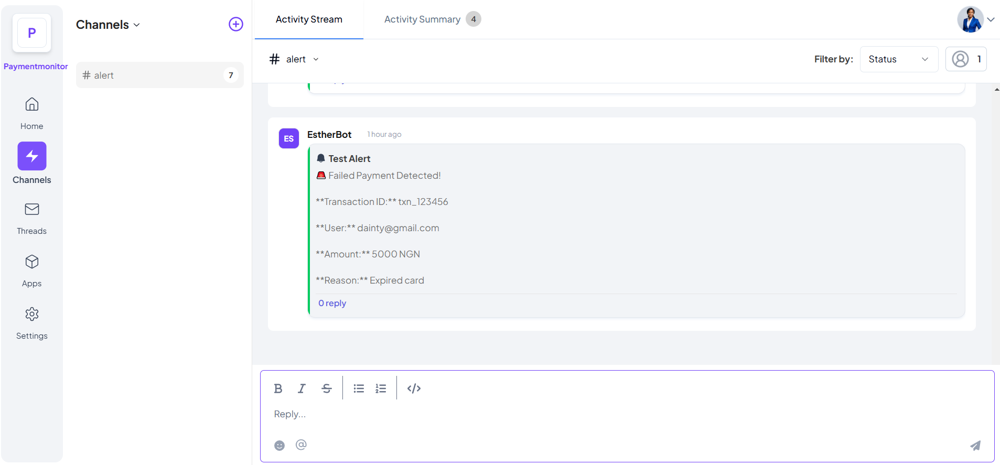
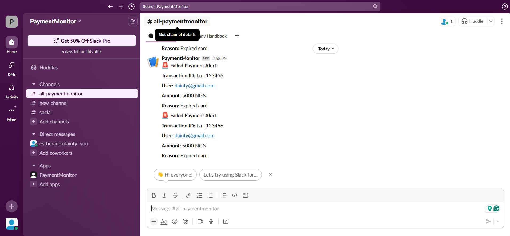
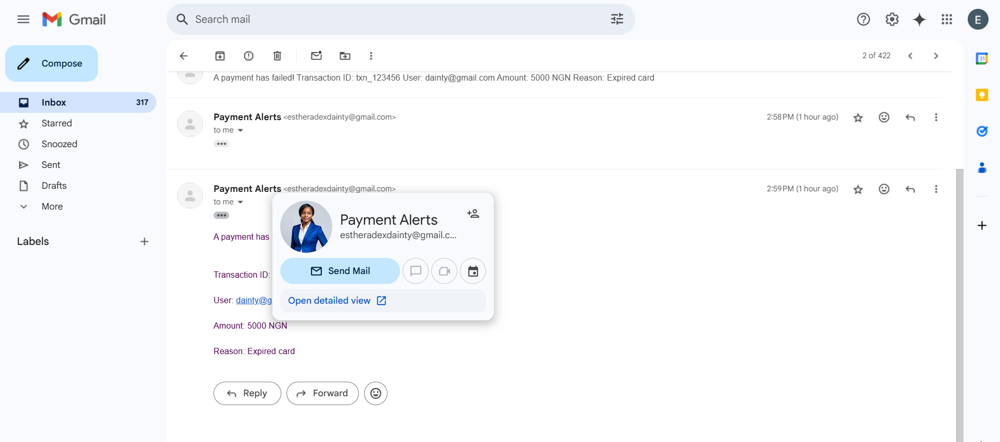

# 🏦 Payment Monitoring & Alerts
🚀 An Output Integration for Telex that monitors failed payments, chargebacks, and revenue updates from Flutterwave, and Paystack. It sends alerts via Telex, Slack, and Email to notify business owners of important transaction issues.

## 📌 Project Overview
The Payment Monitoring & Alerts integration listens to webhook events from payment gateways. When a failed payment, chargeback, or revenue update occurs, it triggers alerts via:
✅ Telex
✅ Slack
✅ Email

This helps businesses stay informed and act quickly on payment issues.

## 🛠 Setup & Installation
🔹 1. Clone the Repository
```sh
git clone https://github.com/telexintegrations/payment-monitoring-alerts.git
cd payment-monitoring-alerts
```

🔹 2. Install Dependencies
```sh
npm install
```

🔹 3. Set Up Environment Variables
Create a .env file in the root folder and add the required keys:
```sh
PORT=3000
TELEX_WEBHOOK_URL=https://telex.im/api/webhook
SLACK_WEBHOOK_URL=https://hooks.slack.com/services/XXXX/YYYY/ZZZZ
EMAIL_SERVICE=smtp
EMAIL_USER=your-email@example.com
EMAIL_PASSWORD=your-password
```

🔹 4. Start the Server
```sh
node index.js
```

## 🏗 How to Use the Integration
1️⃣ Register your webhook URL with Paystack, or Flutterwave.
2️⃣ Enable webhook events such as payment.failed, chargeback, and revenue.update.
3️⃣ The integration will automatically listen for webhook events.
4️⃣ When an event occurs, alerts will be sent to Telex, Slack, and Email.

🔍 Example Webhook Events & Responses
▶️ Incoming Webhook from Paystack
```sh
{
  "status": "failed",
  "reference": "txn_123456",
  "user": "dainty@gmail.com",
  "amount": 5000,
  "currency": "NGN",
  "reason": "Expired card"
}
```

▶️ Telex Alert Payload Sent
```sh
{
  "event_name": "Payment Alert",
  "username": "EstherBot",
  "status": "failed",
  "message": "🚨 Failed Payment Detected! \n\n**Transaction ID:** txn_123456 \n\n**User:** dainty@gmail.com \n\n**Amount:** 5000 NGN \n\n**Reason:** Expired card"
}
```

## 📸 Screenshots of Telex Alerts
🚀 Telex Notification:

🚀 Slack Notification:

🚀 Email Notification:

## 🌍 Deployment Instructions
1️⃣ Deploy to a Server
You can deploy this project using Render, Railway, or a VPS:
```sh
git push origin main
```

2️⃣ Update the Webhook URL
After deployment, update your webhook URL in Flutterwave or Paystack settings:
```sh
https://your-deployed-url.com/webhook
```

3️⃣ Enable Webhooks in Payment Gateways
Flutterwave: Enable payment.failed, chargeback, and revenue.update in Webhook Settings.
Paystack: Go to Dashboard → Settings → API Keys & Webhooks and enter your webhook URL.

4️⃣ Test Webhooks
Send test events from the payment gateway dashboard to verify alerts.

## 🎯 Conclusion
This integration ensures business owners stay informed about failed transactions, chargebacks, and revenue updates. 🚀

✅ Get instant alerts via Telex
✅ Stay informed through Slack & Email
✅ Monitor payment issues and take action